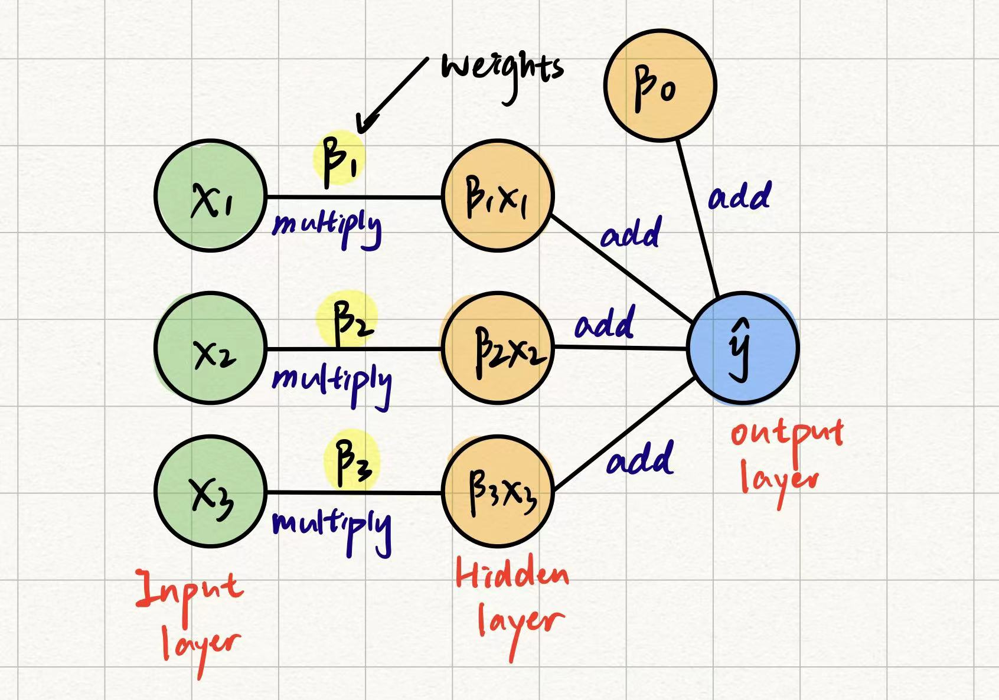
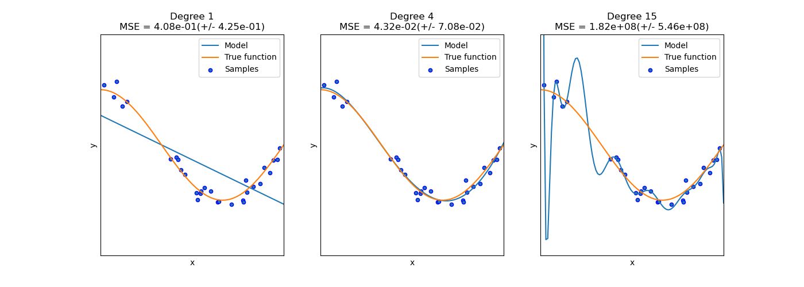

```{r, echo=FALSE}
setwd("~/Documents/Programming/R/Deep Learning with R")
```

\newpage
\section{DL 01 Regression as a first step in deep learning}
\subsection{Prediction from linear regression}
```{r}
# Scenario: predicting sales performance
sales <- c(3, 4, 2, 4, 5, 6, 3, 9, 1, 12)
```
In the simplest way possible, we can simple find the mean of all the observations, and use the mean as our prediction for future sales performances
$$Performance = \frac{\Sigma_{i=1}^n x_i}{n}$$
```{r}
mean.sales <- mean(sales)
mean.sales
```
\subsection{How to measure error in prediction}
However, using only the mean as future prediction is not close to accurate, we are bound to make errors. Thus, to measure the magnitude of the error we are making using the mean, we introduce the concept of *sum of squared errors (SSE)*:
$$SSE = \Sigma_{i = 1}^n (x_i - \bar{X})^2$$
Where $\bar{X}$ is the mean of the observations. 

**NOTE:** There the differences are squared because there can be positive and negative numbers in the differences, and summing positive and negative differences together will make 0. Thus, we need to **square** the differences to make them significant.
```{r}
SSE = sum((sales - mean.sales)^2)
SSE
```
However, the measurement of deviation from actual observations has some limitations:
\begin{enumerate}
  \item In the calculation of SSE, we summed all the differences together, which means the sample size plays a role in the calculation of the deviation. Thus, in order to rule out the effect of sample size on SSE, we introduce the idea of **variance**: $var = \frac{\Sigma_{i = 1}^n (x_i - \bar{X})^2}{n - 1}$, where $n - 1$ is the degrees of freedom. Now, the standard deviation is a square-root version of the measurement of deviation, which makes more sense.
  \item Because the differences are squared, it is hard for us to interpret the deviation, thus, we further introduce the idea of *standard deviation*: $s = \sqrt{\frac{\Sigma_{i = 1}^n (x_i - \bar{X})^2}{n - 1}}$
\end{enumerate}
Both the variance and standard deviation describes how bad the model's prediction is
```{r}
variance <- (sum((sales - mean.sales)^2))/(length(sales) - 1)
variance
# base R function
var(sales)
standard.deviation <- sqrt((sum((sales - mean.sales)^2))/(length(sales) - 1))
standard.deviation
# base R function
sd(sales)
```
So, predictions are bound to have errors:
\begin{align*}
  y_i &= \bar{X} + \epsilon_i\\
  target &= model + error
\end{align*}
**Take away:** After learning about how to measure the accuracy of a prediction model, we now need to know how to optimize the model and letting it to generate more accurate predictions. The task of optimizing the model that minimizes prediction error is the in the scope of Deep Learning!
\subsection{How to potentially reduce prediction error}
Assume that we have a base-line linear regression model that has a SSE we call *sst* (unsystematic variance), if we tune the slope and intercept of the base-line linear regression model, it has a new SSE we call *ssm* (systematic variance). Thus, in order to **measure the improvement in prediction accuracy brought by tuning the parameters in the model**, we introduce the measurement of R-squared: 
$$R^2 = \frac{ssm}{sst}$$
$R^2$ describes the amount of variance that can be described by the new, improved model, with respect to the base-line model.

\subsection{Preview on next section}
**Thought question:** we know that tuning the parameters in the model can lead to improvement in the prediction performance, but how can we find the optimal parameter that can minimize the prediction error (**core** goal in deep learning). This is what we will be covering in the next section

Reference video: https://www.youtube.com/watch?v=0F2bBZiirlg&list=PLH5_eZVldmtUCZWp-eL0lVL7SA6qyDIf9&index=1 

\newpage
\section{DL 02 Linear regression as a Simple Learner "SL"}
\subsection{Related functions/calculations in prediction}
\subsubsection{Prediction function}
From last section, we introduced that predictions can be made with a linear function in the form of:
$$\hat{y_i}(x_i) = \beta_0 + \beta_1x_i$$
Where $\hat{y}$ is the predicted value based on the prediction function
\subsubsection{Loss function}
Loss function is used to measure the amount of error in **one of** our predictions using the model:
$$L(x_i) = [\hat{y_i}(x_i) - y_i]^2$$
The loss function is just the SSE that we introduced in the last section, where we take the square of the differences between observed and predicted value, at the ith position (because there are many observations and predictions)
\subsubsection{Cost function}
The cost function is a little from the loss function because the cost function is calculated from the persepective of the overall prediction, instead of each individual prediction's deviation (calculated by loss function):
\begin{align*}
  C(\beta_0, \beta_1) &= \frac{1}{n}\Sigma_{i = 1}^n L\\
                      &= \frac{1}{n}\Sigma_{i = 1}^n [\hat{y_i}(x_i) - y_i]^2\\
                      &= \frac{1}{n}\Sigma_{i = 1}^n [\beta_0 + \beta_1x_i - y_i]^2
\end{align*}

\subsection{How to find the optimial parameters}
Say we find a cost function that is:
\begin{align*}
  C &= \frac{1}{5}\times{[\beta_0 + \beta_1(1.3) - 0.7]^2 + \dots + [\beta_0 + \beta_1(3.3) - 3.5]^2}\\
  &= 6.55 - 4.68\beta_0 + \beta_0^2 - 13.132\beta_1 + 5.08\beta_0\beta_1 + 7.002\beta_1^2
\end{align*}
We can see that the cost function is composed of the two parameters $\beta_0$ and $\beta_1$, and we also know that we want to minimize the cost function. So, our goal now is to find optimal values of $\beta_0$ and $\beta_1$ so that the cost function is at its minimum. The way to achieve so, its through using **partial derivatives**

\begin{align}
  \frac{\partial C}{\partial \beta_0} &= 2\beta_0 + 5.08\beta_1 - 4.68\\
  \frac{\partial C}{\partial \beta_1} &= 5.08\beta_0 + 14.004\beta_1 - 13.132
\end{align}
By solving (1) and (2), we can obtain the following augmented matrix for the linear system:
$$\begin{bmatrix}
2 & 5.08 & 4.68 \\
5.08 & 14.004 & 13.132 \\
\end{bmatrix}$$
Then, we can reduce the augmented matrix which give us the final values for $\beta_0 = -0.532267$ and $\beta_1 = 1.13081$

\subsection{Gradient descent}
The case above is a two dimensional (having to variables), which is rather simple. However, in real-life scenarios, we often have many parameters and we still need to find the set of parameters that minimizes the cost function, so we ought to find a more generalized way to find optimal parameters, so we introduce the idea of **gradient descent**
\begin{enumerate}
  \item Randomly choose a point in space and find the derivative (i.e. slope) of the cost function at that particular point: $slope_x$
  \item Define a learning rate (LR), which is a predefined value for gradient descent
  \item Calculate step: $x_{new} = x - LR\times slope_x$
  \item Repeat the same process from step1-3 for $x_{new}$
\end{enumerate}

Reference video: https://www.youtube.com/watch?v=FrceOv_oJac&list=PLH5_eZVldmtUCZWp-eL0lVL7SA6qyDIf9&index=2 

\newpage
\section{DL 03 Linear regression as a Shallow Neural Network "SNN"}
\subsection{Multiple linear regression in R}
```{r}
df <- read.csv("MultipleLinearRegression.csv")
df
```
After preliminary view of the data, we can see that there are three independent variables $x_1, x_2, x_3$, so we are dealing with a multiple linear regression:
$$\beta_0 + \beta_1x_1 + \beta_2x_2 + \beta_3x_3 \approx y$$
Now, there are four parameters (i.e. $\beta_0, \beta_1, \beta_2, \beta_3$) that we need to tune, in order to optimize prediction, so we have the loss function for the four parameters:
$$L^{(i)}(\beta_0, \beta_1, \beta_2, \beta_3) = (\beta_0 + \beta_1x_1^{(i)} + \beta_2x_2^{(i)} + \beta_3x_3^{(i)} - y^{(i)})^2$$
```{r}
# multiple linear regression
mlr <- lm(y ~., data = df)
summary(mlr)
```

\subsection{Single layer neural network}
Based on the multiple linear regression we conducted in last subsection, we are actually getting into neural network layers. The multiple linear regression itself can be considered as a single layer network (Figure 1: Single Layer Neural Network), where the inputs are taken into hidden layers and multiplied with the weights (the parameters), and then output the prediction in the output layer



Now, here's when things get interesting:
\begin{enumerate}
  \item We can use **forward propagation** to find output prediction (i.e. feeding in input values, and calculate for output)
  \item We can also use **backward propagation** to better tune the parameters (i.e. using the predicted values, we can go back to tune the parameters and allow for better prediction performance)
\end{enumerate}

Reference video: https://www.youtube.com/watch?v=ZX4YSidnQaI&list=PLH5_eZVldmtUCZWp-eL0lVL7SA6qyDIf9&index=6

\newpage
\section{DL 04 Logistic regression as a Neural Network}
\subsection{Why do we need logistic regression?}
So far, we have looked at ways which we can find predictions about numerical outcome, but there are real-life cases where the prediction of binary outcomes is needed. It's where logistic regression comes into play. Logistic regression is specifically designed to deal with prediction of binary outcomes

\subsection{Mechanism of logistic regression}
Logistic regression is similar to simple linear regression in every way except for the outcome variable. Simple linear regression produces numerical outcomes while logistic regression produces binary outcome. Because the rest of the algorithm is just the same as simple linear regression, logistic regression also has parameters $\beta_0, \beta_1, \dots, \beta_n$, and the way in which we can achieve the best prediction model is to find values for the parameters that can minimize the cost function

For logistic regression, the solution is a sigmoidal function:
$$\sigma(z) = \frac{1}{1 + e^{-z}}$$
Where z in the expression can be expressed as $z(\beta_0, \beta_1, \beta_2, \beta_3, \beta_4) = \beta_0 + \beta_1x_1 + \beta_2x_2 + \beta_3x_3 + \beta_4x_4$. One of the key property of sigmoidal function is that its solution is always between 0 and 1, and we can define a threshold (i.e. cutoff) to determine which side the outcome belongs to (i.e. 0 or 1), which fits the purpose of deriving binary outcomes

Reference video: https://www.youtube.com/watch?v=7TjN1kuJidA&list=PLH5_eZVldmtUCZWp-eL0lVL7SA6qyDIf9&index=7 

\newpage
\section{DL 05 Deep Neural Network in R - Example}
\subsection{Libaries \& Data}
```{r, message = FALSE, warning = FALSE}
# import spreadsheet files
library(readr)
# deep learning package
library(keras)
# dynamic interactive tables
library(DT)

data <- read_csv("SimulatedBinaryClassificationDataset.csv",
                 col_names = TRUE)
summary(data)
```

\subsection{Data preprocessing}
Because deep learning is achieved through manipulation of matrices, we cannot pass in dataframe format data, so we need to change the format of the data to matrix during preprocessing
```{r}
# data.frame --> matrix
data  <- as.matrix(data)
# remove the row and col names, leaving only numerical values
dimnames(data) = NULL
mode(data)
```
Also, deep learning involves separate training and testing phases in order optimize the model's performance, so we need tp prepare for training and testing sets during preprocessing
```{r}
# train and test split index
set.seed(123)
index <- sample(2,
                nrow(data),
                replace = TRUE,
                prob = c(0.9, 0.1))
table(index)

# data splitting
x_train <- data[index == 1, 1:10]
x_test <- data[index == 2, 1:10]
y_test_actual <- data[index == 2, 11]
```
In cases where the target variable has multiple categories, our deep learning network wouldn't be able to process raw categorical information, so we need to convert the categories into numerical matrix format. One common way of encoding the target variable is through **one-hot encoding**:

Simply put, one-hot encoding would expand the column vector of categories and make each category an independent column. If the original label fits into a category, then the column with the category will be labeled 1, otherwise 0
```{r}
# use teh to_categorical function in keras package for one-hot encoding
y_train <- to_categorical(data[index == 1, 11])
y_test <- to_categorical(data[index == 2, 11])
```

\subsection{Creating a simple model}
```{r}
model <- keras_model_sequential()

model %>%
  # layer_dense means a densely connected layer
  layer_dense(name = "DeepLayer1",
              units = 10, # hyperparameter: the number of nodes
              activation = "relu",
              # the first layer need to have specification about the input dimension
              input_shape = c(10)) %>%
  layer_dense(name = "DeepLayer2",
              units = 10,
              activation = "relu") %>%
  layer_dense(name = "OutputLayer",
              units = 2,
              # softmax function will provide probabilities of the nodes
              activation = "softmax")

summary(model)
```
According to the summary table of the deep learning model, we can see that the number of parameters is very large:
\begin{enumerate}
  \item DeepLayer 1 has 110 parameters after passing the 10 input values, this is because neural network connects all the input with the nodes in the hidden layer which results in $10 \times 10 = 100$, and there is a bias term associating with every input, so the total number of parameters is $10 + 10\times 10 = 110$
  \item DeepLayer 2 also has 110 parameters, which is from the same reason as DeepLayer 1
  \item OutputLayer has 22 parameters: $10 \times 2 + 2 = 22$
  \item Thus, the total number of parameters in our two hidden layer network is already so large: $110 + 110 + 22 = 242$, so we need to tune 242 parameters for the model through forward/backward propagation, which can make the performance so much better 
\end{enumerate}

\subsection{Compile the model}
```{r}
model %>% compile(
  # another way to calculate loss, besides mean-squared-error
  loss = "categorical_crossentropy", 
  # a special way of gradient descent
  optimizer = "adam",
  # measurement of model performance - using accuracy to measure
  metrics = c("accuracy")) 
```

\subsection{Fitting the data}
```{r}
history <- model %>%
  fit(x_train,
      y_train,
      # number of full forward & backward propagation
      # (i.e. run 10 times back and forth of all samples)
      epoch = 10, 
      # instead of propagating the whole dataset at one go, use smaller batches
      batch_size = 256, 
      # splitting the training set to test itself during training
      validation_split = 0.1, 
      verbose = 2)
```
Arguments for fitting the model (hyperparameters):
\begin{enumerate}
  \item epoch: one forward pass and one backward pass of \textbf{all} the training samples
  \item batch size: the number of training examples in one forward/backward pass, usually, for better memory performance, we use values that are $2^n$
\end{enumerate}
```{r, message = F}
# plot the training history
plot(history)
```


\subsection{Model evaluation}
Be aware of the new update in tensorFlow 2.8.0: https://keras.rstudio.com/reference/predict_proba.html 
```{r}
model %>%
  evaluate(x_test,
           # NOTE: here we are still using the one-hot encoded y_test
           y_test)

# form predictions
pred <- model %>%
  predict(x_test) %>%
  k_argmax()
# reference for converting tensor to R data types
# https://torch.mlverse.org/technical/tensors/
pred <- as.array(pred)
table(Predicted = pred,
      # NOTE: for confusion matrix, we are using the original y_test_actual, not encoded
      Actual = y_test_actual)
```

\newpage
\section{DL 06 Bias and Variance in Deep Learning}
"Learning from the mistakes" is essential for improving the model's performance
\subsection{Ground truth}
Mistakes are defined with respect to the ground truth, but have you ever wondered: where does the ground truth come from? and Why are they the ground truth, but not others?
\begin{enumerate}
  \item Ground truth are the labeled data, either by professionals or experts in the area, that we generally believe are the truth, because of their authority in the field
  \item It goes without saying that experts and professionals are also humans, so they do make mistakes sometimes, which means, the so called ground truth is sometimes even incorrect
  \item There is a theoretical minimum possible error - **Bayes error**
  \item The goal of neural network is to approach the Bayes error, or at least outperform human error
\end{enumerate}

After all, we need a measurement that can tell us whether our neural network is doing well. So, here's where **bias** and **variance** comes in:

\subsection{Bias and Variance}
The diagram a vivid depiction of the tradeoff between bias and variance (reference link: https://scikit-learn.org/stable/modules/learning_curve.html)



\begin{enumerate}
  \item The graph on the left is a decision boundary, which does not describe the trend of the data well, so we call this type of scenario - \textbf{underfitting}. Underfitted model produce poor prediction after taking in input (Bias problem)
  \item The graph in the middle is the optimal model, where we can see that the model is closely aligned with the true values - what we want to achieve in machine learning
  \item The graph on the right is an overshot, because we have increase the degree of the polynomial curve so much, the model almost pass through every single data point, which seems like the model have \textbf{memorizing} the data. This type of scenario is called \textbf{overfitting}. Overfitted model separates the training data so well, but when we provide it with new data, then the performance will be deprecated a lot (Variance problem)
\end{enumerate}

Luckily, there are ways for us to quantify bias and variance, in order to inform changes in the neural network: training set error and validation set error:
\begin{enumerate}
  \item Overfitting (high variance): when the training set error is very small comparing with the validation set error
  \item Underfitting (high bias): when both the training set error and the validation set error are large
  \item \textbf{However,} there is a case when training set error is close to the validation set error while also pretty close to the Bayes error (optimal error). In this case, the model's performance is very good! and we can attribute the error to the intrinsic deviations in the labeling of the data itself, not the modeling
\end{enumerate}

After learning about how to identify the problem with the model (whether it has high bias or high variance), here are the things that we can do to resolve those problems:
\begin{enumerate}
  \item Correcting high bias
    \begin{enumerate}
      \item Create a bigger network (e.g. more layers, more nodes per layer)
      \item Train for more epoch (high bias might be that gradient descent has not reached bottom yet)
      \item Try a different architecture
    \end{enumerate}
  \item Correcting high variance
    \begin{enumerate}
      \item Capture more data
      \item Augment the data
      \item Regularization, dropout, batch normalization (what we can manipulate in code, will be discussed in the next section)
    \end{enumerate}
\end{enumerate}

\newpage
\section{DL 07 Regularization in Deep Learning}
In the last section, we encountered a case where the model is too specific to the extent that it only memorizes the training data, but cannot generalize to new data. One way to deal with high variance is to use **regularization**.

\subsection{Where does variance arise}
Before we learn the mechanism of regularization, we need to know that the key to a functional neural network is the optimization of values of the parameters in the model (also called the unknowns). The performance of the model totally depends on how well the parameters are optimized. The collection of all the possible solutions is known as the **hypothesis space**. 

However, from figure 2 in the last section, we learned that when the model is too "twisted" (mathematically, because it included too many parameters, so the model become too polynomial), the variance of the model is very high (i.e. describing the training data really well, but become really weak when new data is provided).

Thus, in order to trim the model to make it more generalizable, we need to **reduce the hypothesis space**. Let hypothesis space denoted as H, then the goal is to find find the optimal subspace of the hypothesis space among ($H_1$ is subset of $H_2$, which are both subsets of $H_n$):
$$H_1 \subset H_2 \subset \dots H_n$$

\subsection{Levels of complexity}
Recall that linear regression is just a single hidden layer system (where the weights are applied linearly to each input variable), which includes the following layers of complexity:
\begin{enumerate}
  \item The dimension of the input space (i.e. the number of feature variables that was provided)
  \item $l_0$ complexity: the number of non-zero coefficients. In the case of linear regression: $w_1x_1 + w_2x_2 + \dots + w_nx_n$
  \item $l_1$ complexity (also called \textbf{lasso complexity}): the sum of the absolute values of the coefficients: $\Sigma_{i=1}^n w_i$
  \item $l_2$ complexity (also called \textbf{ridge complexity}): the sum of the squares of the coefficients: $\Sigma_{i=1}^n w_i^2$
\end{enumerate}

\subsection{$l_2$ Regularization}
We will regularize using the $l_2$ complexity (i.e. $l_2$ regularization) in this section:

\subsubsection{Setting up the cost function}
Recall that in previous sections, we optimize the model using cost function:
$$\mathcal{C}(W, b) = \frac{1}{m}\Sigma_{i=1}^m\mathcal{L}(\hat{y}^{(i)}, y^{(i)})$$
Where $\mathcal{L}(\hat{y}^{(i)}, y^{(i)})$ is the loss function

\subsubsection{Cost function with regularization}
Now, we add a new term to the cost function, the $l_2$ complexity. The resulting cost function with regularization term is called **Tikhanov regularization**:
$$\mathcal{C}(W, b) = \frac{1}{m}\Sigma_{i=1}^m\mathcal{L}(\hat{y}^{(i)}, y^{(i)}) + \frac{\lambda}{2m}\Sigma_{l=1}^L||W^{[l]}||^2$$
Where:
\begin{enumerate}
  \item The L in the second term is the number of layers in the neural network, which is different from the loss function in the first term
  \item $\lambda$ is a hyperparameter that means the weight of the regularization term to make it significant to the cost function, so we can reduce the dimension of the weight terms (i.e. reduce the complexity of the neural network). The value of $\lambda$ is defined by us, which depends on the amount of significance we want to attribute to the weight terms
  \item W is a matrix of weights with dimension $n^{[l]}\times n^{[l] - 1}$ where l is the current layer and $n^{[l]}$ is the number of nodes at layer l
  $$||W^{[l]}||^2 = \Sigma_{i=1}^{n^{[l]}}\Sigma_{j=1}^{n^{[l-1]}}(w_{ij})^2$$
  \item The $\frac{1}{2}$ in the second term is just a scaling factor for easier partial derivative during back propagation 
\end{enumerate}

\subsubsection{Logic behind the regularization term}
The reason why we add the new term of $l_2$ complexity is that, as we are trying to minimize the cost function, we would also want to minimize $\frac{\lambda}{2m}\Sigma_{l=1}^L||W^{[l]}||^2$ (i.e. reduce the weights to approach 0). Reducing the weights to let them approach 0 is similar to dimension reduction, which fits the purpose of reducing the hypothesis space (**since hypothesis space contains possible parameters, or weights, if some of them approaches zero, then the dimension will be reduced, then the model's complexity will reduce to avoid high variance**)

\subsubsection{Back propagation}
After setting up the logic behind the $l_2$ regularization term, we need to get back on track to our goal of finding the best parameters, **with a reduced hypothesis space dimension**. The way to go is through gradient descent in back propagation:
$$\frac{\partial \mathcal{C}(W, b)}{\partial W^{[l]}} = \psi + \frac{\lambda}{m}W^{[l]}$$
Where $\psi$ is the original derivative of the cost function without the regularization term. Now, apply gradient descent for the parameters:
$$W^{[l]}_{new} = W^{[l]} - \alpha \frac{\partial \mathcal{C}(W, b)}{\partial W^{[l]}}$$


\subsection{Dropout regularization}
In the last subsection, we talked about $l_2$ regularization. Regularization, especially $l_2$ regularization, is commonly used to **decrease the variance in deep neural networks**. Adding the extra regularization term to the cost function creates a simpler, more linear model, that can effectively avoid overfitting. Dropout regularization basically does the same thing, except it randomly select nodes in each hidden layer of the neural network and assign them to zero. After the assignment, the number of complexity (i.e. number of parameters) will be reduced tremendously, which fits the purpose of reducing the hypothesis space

\newpage
\section{DL 08 Regularization and dropout using Keras in R}
\subsection{Libraries}
```{r message=FALSE, warning=FALSE}
library(keras)
library(readr)
library(tidyr)
library(tibble)
library(plotly)
```

\subsection{Data}
The dataset is built into Keras, which contains text samples using multi-hot encoding (recall from previous sections where we talked about using one-hot encoding to encode for categorical variables)
```{r}
# specify the number of feature variables for the dataset to be downloaded
num_words <- 5000
imdb <- dataset_imdb(num_words = num_words)
```
\subsubsection{Train test set split}
```{r}
# train test split
c(train_data, train_labels) %<-% imdb$train
c(test_data, test_labels) %<-% imdb$test
# training and test data are both stored as lists
length(train_data)
```
\subsubsection{Multi-hot encoding}
Because the dataset is stored as texts, but neural networks requires numerical matrices, we need to encode the text. At the same time, because there are so many parameters (we chose to include 5000 words as parameters), we will use a encoding method called **multi-hot encoding** which is similar to one-hot encoding, but in a much larger scale
```{r}
# multi-hot encoding
multi_hot_sequences <- function(sequences, dimension){
  multi_hot <- matrix(0, 
                      # the number of samples in the sequences
                      # sequences are stored as lists
                      nrow = length(sequences), 
                      ncol = dimension)
  for(i in 1 : length(sequences)){
    # sequences[[i]] extracts the label of the words in the text sample i
    # which ever word is included in that sequence will be assigned 1 at row i
    multi_hot[i, sequences[[i]]] <- 1
  }
  multi_hot
}

train_data <- multi_hot_sequences(train_data, num_words)
test_data <- multi_hot_sequences(test_data, num_words)
```

\subsection{Modeling}
\subsubsection{Base-line model}
```{r}
baseline_model <-
  keras_model_sequential() %>%
  layer_dense(units = 16, activation = "relu", input_shape = num_words) %>%
  layer_dense(units = 16, activation = "relu") %>%
  layer_dense(units = 1, activation = "sigmoid")

baseline_model %>% compile(
  optimizer = "adam",
  loss = "binary_crossentropy",
  metrics = list("accuracy")
)

baseline_model %>% summary()
```
\subsubsection{Fit base-line model}
```{r}
baseline_history <- baseline_model %>% fit(
  train_data,
  train_labels,
  epochs = 20,
  # recall: batch size controls the number of training samples to work through before updating parameters
  batch_size = 512,
  validation_data = list(test_data, test_labels),
  # get loss and accuracy reports
  verbose = 2
)

plot(baseline_history)
```
From the training validation history graph, we can see that there is a huge discrepancy between the training loss (very low) and the validation loss (very high). Also, the training accuracy is very high comparing with the validation accuracy. This high discrepancy indicates that our neural network is **overfitting** the training samples (high variance)

\subsection{Fixing overfitting}
\subsubsection{Smaller model}
```{r}
smaller_model <- keras_model_sequential() %>%
  layer_dense(units = 4, activation = "relu", input_shape = num_words) %>%
  layer_dense(units = 4, activation = "relu") %>%
  layer_dense(units = 1, activation = "sigmoid")

smaller_model %>% compile(
  optimizer = "adam",
  loss = "binary_crossentropy",
  metrics = list("accuracy")
)

smaller_model %>% summary()

smaller_history <- smaller_model %>% fit(
  train_data,
  train_labels,
  epoch = 20,
  batch_size = 512,
  validation_data = list(test_data, test_labels),
  verbose = 2
)

plot(smaller_history)
```
According to the plot, we can still see a huge discrepancy between the loss of the training and validation set. This is still an indication of overfitting on the training set, learning to high variance

\subsubsection{L2 regularization}
```{r}
l2_model <-
  keras_model_sequential() %>%
  layer_dense(units = 16, activation = "relu", input_shape = num_words,
              # apply regularization in the layer_dense function's argument
              kernel_regularizer = regularizer_l2(l = 0.001)) %>%
  layer_dense(units = 16, activation = "relu",
              kernel_regularizer = regularizer_l2(l = 0.001)) %>%
  layer_dense(units = 1, activation = "sigmoid")

l2_model %>% compile(
  optimizer = "adam",
  loss = "binary_crossentropy",
  metrics = list("accuracy")
)

l2_model %>% summary()

l2_history <- l2_model %>% fit(
  train_data,
  train_labels,
  epoch = 20,
  batch_size = 512,
  validation_data = list(test_data, test_labels),
  verbose = 2
)

plot(l2_history)
```
There's definitely still overfitting in the network, but not as bad as when there were not regularization applied

\subsubsection{Dropout regularization}
```{r}
drop_model <- keras_model_sequential() %>%
  layer_dense(units = 16, activation = "relu", input_shape = num_words) %>%
  # a new layer to specify the dropout rate
  layer_dropout(0.6) %>%
  layer_dense(units = 16, activation = "relu") %>%
  layer_dropout(0.6) %>%
  layer_dense(units = 1, activation = "sigmoid")

drop_model %>% compile(
  optimizer = "adam",
  loss = "binary_crossentropy",
  metrics = list("accuracy")
)

drop_model %>% summary()

drop_history <- drop_model %>% fit(
  train_data,
  train_labels,
  epoch = 20,
  batch_size = 512,
  validation_data = list(test_data, test_labels),
  verbose = 2
)

plot(drop_history)
```
The dropout regularization seems to generate a further improvement from the l2 regularization. The gap between training loss and validation loss is getting even smaller

\newpage
\section{DL 09 Improving learning in Deep Neural Networks "DNNs"}
\subsection{Normalization}
The data comes in with different scales of parameters, some may be single digits, while others can be as large as hundreds of thousands. With such great variation in the scale of the numbers, gradient descent may become computationally more expensive. Thus, the first step of creating a neural network is to normalize the data values to a similar scale:
$$\frac{x_i - \mu}{\sigma^2}$$
Where $\mu$ is the mean of the feature variable in the training set, $\sigma^2$ is the variance of the feature variable in the training set.

**NOTE:** scaling need to be applied to both the training and test set. The test set need to be scaled with the same scaling factors $\mu \ \ \& \ \ \sigma^2$, instead of using mean and variance of its own

\subsection{Vanishing and exploding gradients}
In mathematics, when we multiply two fractions, both smaller than 1, we have the following:
$$\frac{1}{2} \times \frac{2}{3} = \frac{1}{3}$$
$$\frac{1}{4} \times \frac{9}{10} = \frac{9}{40}$$
The resulting fraction is getting smaller and smaller, smaller than either one of the contributing fraction during multiplication. Thus, we have the following rule:
$$\frac{a}{b} \times \frac{c}{d} = \frac{ac}{bd}, \forall a<b, c<d, {a, b, c, d} \in Z^+$$
$$(\frac{a}{b} > \frac{ac}{bd}) \land (\frac{c}{d} > \frac{ac}{bd})$$
Using this logic, if we are multiplying weights with other weights in a deep neural network and the weights are small, then the resulting product will eventually vanish (**Vanishing gradient problem**)

On the other hand, if the weights are larger than 1, after numerous multiplications, the resulting weight product would be very large (**Exploding gradient problem**)

One way to prevent such vanishing and exploding gradient problems is to normalize the weights before-hand. The initial weights are just random values, so we can manipulate those weights to prevent exploding or vanishing. The way to do is to set the variance of the weight matrix to the reciprocal of the number of input nodes to be multiplied by the matrix

\subsection{Mini-batch gradient descent}
Mini-batch gradient descent is a way to modify the parameters through gradient descent for more times. Because traditional gradient descent is completed per epoch, that is only when the whole dataset has went forward and backward, can the parameter be updated using gradient descent, which is pretty inefficient. Thus, we introduce the mini-batch gradient descent, which is dividing the huge dataset into smaller batches, and after every back and forth of each small batch, the parameters can be tuned through gradient descent using the mini-batch. This would allow for much more tuning cycles of the parameters

**Extreme case:** if the mini-batch is chosen to have size 1, then the gradient descent is called *stochastic gradient descent*

\subsection{Gradient descent with momentum}
Outside reference link: https://youtu.be/NxTFlzBjS-4 

\subsubsection{Exponentially weighted moving average (EWMA)}
In previous sections, gradient descent is conducted according to the current partial derivative. However, if the data points have intrinsic variance, the gradient descent would fluctuate a lot. Thus, to adapt slower (i.e. with more latency) to the data, we introduce the way of **Exponentially Weighted Moving Average (EWMA)**:
$$v_i = \beta\times v_{i-1} + (1-\beta)\times y_i$$
Where $y_i$ is the current partial derivative, $v_{i-1}$ is the previous moving average, and $\beta$ is the weight assigned to the gradients, the decay factor. The equation approximate to averaging the past $\frac{1}{1-\beta}$ data points with weights (e.g. if we assign $\beta = 0.9$, then the moving average will take the weighted average of the past $\frac{1}{1-0.9} = 10$ data points. Visit https://youtu.be/NxTFlzBjS-4 for more detailed explanation on the approximation of the number of previous data points taken into account for the average)

So, now the gradient descent with momentum becomes:
$$V_{\partial W_i} = \beta_vV_{\partial W_{i-1}} + (1-\beta)\partial W_i$$
Then, instead of multiplying the step size with the partial derivative at the current point, the step size is multiplied with the moving average (to let more data points contribute to the descent)
$$W_i = W_{i-1}- \alpha V_{\partial W_{i-1}}$$

\subsubsection{Root mean square propagation (RMSprop)}
Root Mean Square Propagation (RMSprop) is very similar to EWMA except that the partial derivative in the average calculation is squared:
$$S_{\partial W_i} = \beta_s S_{\partial W_{i-1}} + (1-\beta)\partial W_{i}^2$$
$$W_i = W_{i-1} - \alpha \frac{\partial W_{i-1}}{\sqrt{S_{\partial W_{i-1}}}}$$

\subsubsection{Adaptive moment estimation (ADAM)}
One of the most widely used optimization algorithm for gradient descent is the combination of EWMA and RMSprop, making the adaptive moment estimation algorithm (ADAM)

Besides combining the two (i.e. EWMA and RMSprop), we need to conduct bias correction (because it is hard to get the momentum going, since the initial average is just 0):
$$\hat{V_{\partial W_i}} = \frac{V_{\partial W_i}}{1-\beta^i}$$
$$\hat{S_{\partial W_i}} = \frac{S_{\partial W_i}}{1-\beta^i}$$
Then, combine the two algorithms to update the weight:
$$W_{i+1} = W_i - \alpha \frac{\hat{V_{\partial W_i}}}{\sqrt{\hat{S_{\partial W_i}}}}$$

\newpage
\section{DL 10 Using tfruns to compare models}
In this section we will be implementing the optimization techniques that we introduced in the last section

\subsection{Milestone 1: Loading the data}
```{r, warning = FALSE}
library(keras)
library(readr)

train.import <- read_csv("ImprovementsTrain.csv")
test.import <- read_csv("ImprovementsTest.csv")

# recall that NN are constructed based on numerical matrices
# we need to cast dataframe into matrix and remove column names
train.import <- as.matrix(train.import)
dimnames(train.import) <- NULL
test.import <- as.matrix(test.import)
dimnames(test.import) <- NULL

# train & test sets
train_data <- train.import[, 1:12]
train_labels <- train.import[, 13]
test_data <- test.import[, 1:12]
test_labels <- test.import[, 13]
```

\subsection{Milestone 2: Normalizing the data}
Recall that normalization of the data can cast the data points into similar scales and reduce the computation expense:
$$\frac{x-\mu}{\sigma}$$
```{r}
feature.means = vector(length = ncol(train_data))
for(i in 1:length(feature.means)){
  # calculate the mean of each column in the training set
  feature.means[i] = mean(train_data[, i])
}

feature.sds = vector(length = ncol(train_data))
for(i in 1:length(feature.sds)){
  # calculate the standard deviation of each column in the training set
  feature.sds[i] <- sd(train_data[, i])
}
```
**NOTE:** the normalization parameter should be from the training set, and be applied to **both the training and test sets**
```{r}
# normalize the feature variables in the training set
train_data_normalized <- matrix(nrow = nrow(train_data),
                                ncol = ncol(train_data))
for(n in 1:ncol(train_data)){
  for(m in 1:nrow(train_data)){
    train_data_normalized[m, n] <- (train_data[m, n] - feature.means[n])/feature.sds[n]
  }
}

# normalize the feature variables in the testing set
test_data_normalized <- matrix(nrow = nrow(test_data),
                                ncol = ncol(test_data))
for(n in 1:ncol(test_data)){
  for(m in 1:nrow(test_data)){
    test_data_normalized[m, n] <- (test_data[m, n] - feature.means[n])/feature.sds[n]
  }
}
```

\subsection{Milestone 3: modeling}
Incorporate the gradient descent algorithms we discussed in the last section together with the sequential dense layer model we have created before:
\subsubsection{Baseline model}
```{r}
# use normal distribution to set the very first weights in tensor
init_w <- initializer_random_normal(mean = 0,
                                    stddev = 0.05,
                                    seed = 123)
# by default, all the bias terms are set to 0 initially
init_B <- initializer_zeros()

baseline_model <- keras_model_sequential() %>%
  layer_dense(units = 48,
              activation = "relu",
              # the initial weights for the NN
              kernel_initializer = init_w,
              input_shape = c(12)) %>%
  layer_dense(units = 48,
              activation = "relu") %>%
  layer_dense(units = 1,
              activation = "sigmoid")

summary(baseline_model)
```
\subsubsection{Propagation with momentum}
```{r}
baseline_model %>% compile(
  optimizer = optimizer_rmsprop(
    # learning rate (i.e. step size)
    lr = 0.001,
    # the decay factor (i.e. the weight to the previous gradient, beta)
    rho = 0.9
  ),
  loss = "binary_crossentropy",
  metrics = list("accuracy")
)
```
\subsubsection{Fit the model}
```{r}
baseline_history <- baseline_model %>%
  fit(train_data_normalized,
      train_labels,
      epochs = 40,
      # conditions when to stop, save computation time
      # avoid scenario of training without improvements
      callbacks = list(callback_early_stopping(
        # use change in loss to determine whether to stop
        monitor = "loss",
        # wait for two runs, if unchanged in loss, then stop
        patience = 2
      )),
      batch_size = 512,
      validation_data = list(test_data_normalized, test_labels),
      verbose = 2)

plot(baseline_history)
```
**For more documentations on devising NN algorithms, visit:** https://keras.rstudio.com/reference/index.html 


